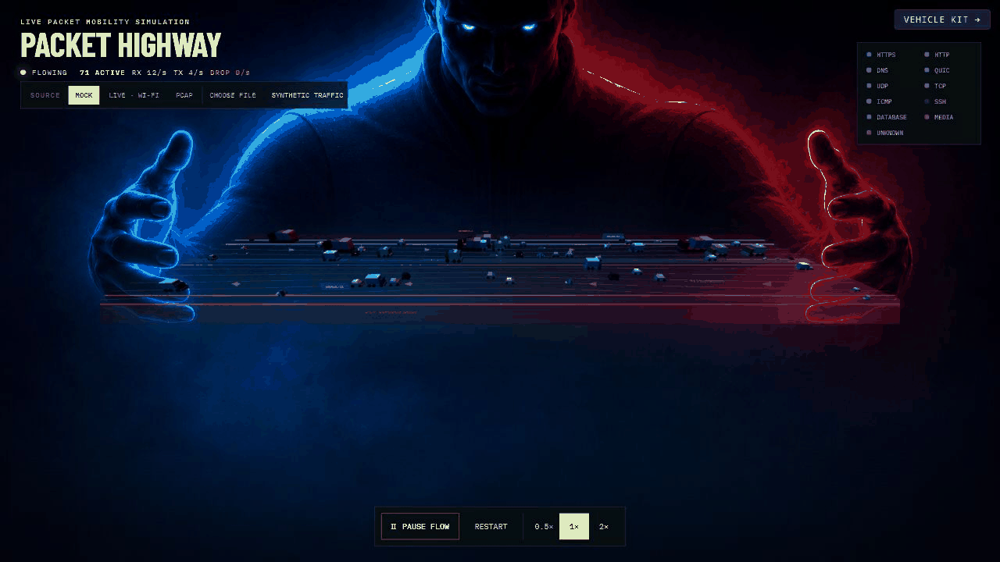
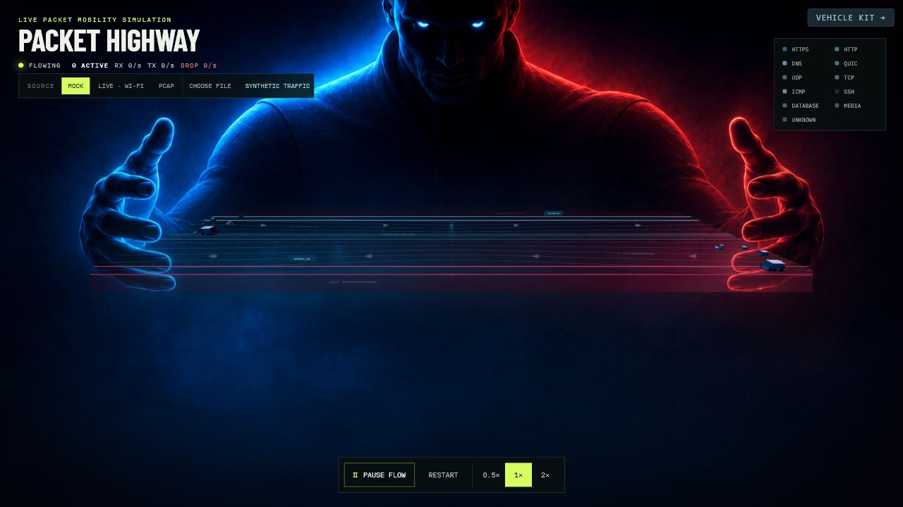

# Packet Highway

[中文](#中文说明) | [English](#english)

## 动态演示 / Animated Demo



<details>
<summary>完整静态效果图 / Full static preview</summary>



</details>

## 中文说明

Packet Highway 是一个使用 React、TypeScript、React Three Fiber 和 Three.js
构建的 3D 网络流量可视化项目。它把网络报文映射为在全息高速公路上行驶的车辆，
帮助用户直观理解协议类型、流量方向、报文大小和异常状态。

### 设计理念

- **报文即车辆**：不同协议使用不同车型和颜色。
- **双向公路**：RX 从左侧蓝色手掌驶向右侧红色手掌，TX 方向相反。
- **HTTPS 主干道**：HTTPS 使用稳定、连续的主车流。
- **协议行为**：DNS 突发、ICMP 快速探测、Media 重载慢行、Internal 规律运输。
- **异常肩道**：错误车辆离开主路、驶入肩道并停止。
- **真实数据映射**：真实报文可展示源/目的 IP、端口、协议、长度和错误信息。
- **性能控制**：限制同时可见车辆数量，并对真实报文渲染进行节流。

### 数据源

1. **Mock**：内置合成流量，无需安装额外工具。
2. **Live**：通过 TShark 读取本机 `Wi-Fi` 网络接口。
3. **PCAP**：回放默认抓包，或上传 `.pcap`、`.pcapng`、`.cap` 文件。

### 环境要求

- Node.js 18 或更高版本
- npm
- 可选：Wireshark/TShark，用于实时接口和 PCAP
- Windows 实时抓包通常还需要 Npcap

确认 TShark 可用：

```bash
tshark --version
```

### 安装与运行

```bash
git clone git@github.com:gray-hvge/packet-traffic-city.git
cd packet-traffic-city
npm install
npm run dev
```

打开：

```text
http://127.0.0.1:5173/
```

`npm run dev` 会同时启动：

- Vite 前端：`127.0.0.1:5173`
- 抓包服务：`127.0.0.1:5174`

### 使用 PCAP

推荐直接点击界面的 **Choose file** 上传抓包文件。最大上传大小为 150 MB。

也可以通过环境变量设置 **PCAP** 按钮使用的默认文件：

PowerShell：

```powershell
$env:PACKET_HIGHWAY_DEFAULT_PCAP="C:\captures\sample.pcapng"
npm run dev
```

bash：

```bash
PACKET_HIGHWAY_DEFAULT_PCAP=/captures/sample.pcapng npm run dev
```

### 常用命令

```bash
npm run dev
npm run test
npm run lint
npm run build
npm run preview
```

### 项目结构

```text
src/components/highway/    公路、肩道与道路标记
src/components/vehicle/    车辆生成、运动与停止行为
src/components/vehicleKit/ 协议车型
src/components/layout/     数据源、图例、控制器与报文详情
src/services/              浏览器端抓包服务客户端
server/                    TShark、PCAP 与 WebSocket 服务
```

## English

Packet Highway is a 3D network traffic visualization built with React,
TypeScript, React Three Fiber, and Three.js. Network packets become vehicles on
a holographic highway, making protocol, direction, packet size, and error states
easier to understand.

### Design

- **Packets as vehicles**: each protocol has a distinct vehicle and color.
- **Bidirectional highway**: RX travels from the blue left palm to the red right
  palm; TX travels in the opposite direction.
- **HTTPS backbone**: HTTPS forms the dominant, steady traffic stream.
- **Protocol behavior**: DNS bursts, fast ICMP probes, slow heavy media traffic,
  and regular internal cargo.
- **Error shoulder**: failed vehicles leave the main road, pull over, and stop.
- **Real packet details**: source/destination IP, ports, protocol, length, and
  error information are available when real packets are used.
- **Performance controls**: visible vehicle count is capped and real packet
  rendering is throttled.

### Data Sources

1. **Mock**: built-in synthetic traffic with no extra dependencies.
2. **Live**: captures the local `Wi-Fi` interface through TShark.
3. **PCAP**: replays a configured capture or an uploaded `.pcap`, `.pcapng`, or
   `.cap` file.

### Requirements

- Node.js 18 or newer
- npm
- Optional: Wireshark/TShark for live capture and PCAP replay
- Npcap is usually required for live capture on Windows

Check that TShark is available:

```bash
tshark --version
```

### Install and Run

```bash
git clone git@github.com:gray-hvge/packet-traffic-city.git
cd packet-traffic-city
npm install
npm run dev
```

Open:

```text
http://127.0.0.1:5173/
```

`npm run dev` starts both:

- Vite frontend: `127.0.0.1:5173`
- Capture service: `127.0.0.1:5174`

### PCAP Usage

The easiest option is **Choose file** in the interface. Uploads are limited to
150 MB.

To configure the default file used by the **PCAP** button:

PowerShell:

```powershell
$env:PACKET_HIGHWAY_DEFAULT_PCAP="C:\captures\sample.pcapng"
npm run dev
```

bash:

```bash
PACKET_HIGHWAY_DEFAULT_PCAP=/captures/sample.pcapng npm run dev
```

### Commands

```bash
npm run dev
npm run test
npm run lint
npm run build
npm run preview
```

### Project Layout

```text
src/components/highway/    Road, shoulder, and road labels
src/components/vehicle/    Vehicle spawning, motion, and stopping behavior
src/components/vehicleKit/ Protocol-specific vehicles
src/components/layout/     Sources, legend, controls, and packet details
src/services/              Browser capture-service client
server/                    TShark, PCAP, and WebSocket service
```
